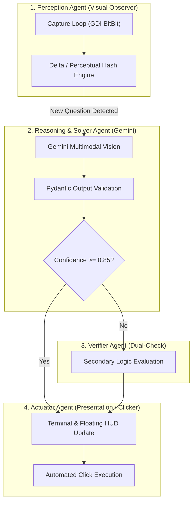
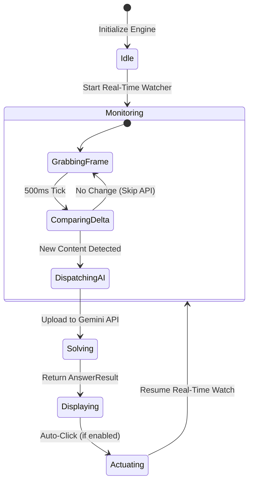

# 🤖 Agent Architecture & Autonomous Workflows (`AGENTS.md`)

This document defines the agentic architecture, roles, multi-agent workflows, and design patterns utilized in **Auto Answer**.

---

## 🏗️ Multi-Agent System Overview

Auto Answer operates on a decoupled multi-agent paradigm where specialized sub-agents handle discrete responsibilities across the perception-reasoning-action loop:



---

## 👥 Agent Role Specifications

### 1. Visual Observer Agent (`auto_answer.capture`)
- **Primary Objective**: Continuously monitor screen activity at lowest possible compute footprint and recognize when a new question has appeared.
- **Responsibilities**:
  - Sample screen region at designated intervals (e.g. 500ms - 1000ms).
  - Calculate perceptual difference against the previous stable frame.
  - Suppress duplicate API requests when the user is idle on the same question.
  - Trigger downstream analysis only on verified scene state transitions.
- **Latency Budget**: `< 15ms` per frame evaluation.

---

### 2. Vision Reasoning Agent (`auto_answer.ai.solver`)
- **Primary Objective**: Ingest raw visual pixels, transcribe textual and diagrammatic tokens, and deduce the logically verified answer.
- **Core Model**: `gemini-2.5-flash` or `gemini-3.8-flash`.
- **System Directive**:
  ```text
  You are an expert academic and technical exam solver with 100% precision.
  Your task is to analyze screenshot images of questions from quizzes, tests, canvas, or emulators.
  1. Accurately transcribe the exact question text and all available options from the image.
  2. Determine the objectively correct answer based on established knowledge, official standards, and curriculum.
  3. Map options to index (0, 1, ...) and letter labels (A, B, ...).
  4. Provide a very concise 1-2 sentence explanation proving why the answer is correct.
  5. Provide a confidence rating between 0.0 and 1.0.
  ```
- **Output Schema**: Strictly enforced JSON deserialized directly into `AnswerResult`.
- **Latency Budget**: `600ms - 1200ms` total network turn.

---

### 3. Verification & Guardrail Agent
- **Primary Objective**: Ensure answer integrity and prevent hallucinated answers on ambiguous, trick, or multi-select questions.
- **Rules**:
  - Evaluates whether the question specifies "Select all that apply" or "Which of the following is FALSE/NOT".
  - If initial confidence falls below `85%`, prompts self-critique or selects the highest-probability alternative.
  - Flags corrupted crops (e.g. half the question is cut off) and warns the user via UI rather than guessing blindly.

---

### 4. Actuator & Presentation Agent (`auto_answer.ui` & `auto_answer.automation`)
- **Primary Objective**: Render findings to the user with zero friction and optionally perform input automation.
- **Responsibilities**:
  - Update the active PowerShell console with rich color coding and status checkmarks.
  - Broadcast results to the lightweight floating HUD widget without interrupting emulator window focus.
  - If `clicker.enabled` is active, compute spatial coordinates of the winning radio button and dispatch a simulated click event.

---

## 🔄 Real-Time State Machine



---

## 🛠️ Extending with Custom Agents

Developers can attach custom evaluation agents by subclassing `GeminiQuestionSolver` or subscribing to the `on_answer_solved` event bus:

```python
from auto_answer.ai.solver import AnswerResult

class CustomAuditorAgent:
    def on_answer_solved(self, result: AnswerResult) -> None:
        # Custom logging, webhooks, or secondary verification
        print(f"Auditing answer for question: {result.question_text[:40]}...")
```
