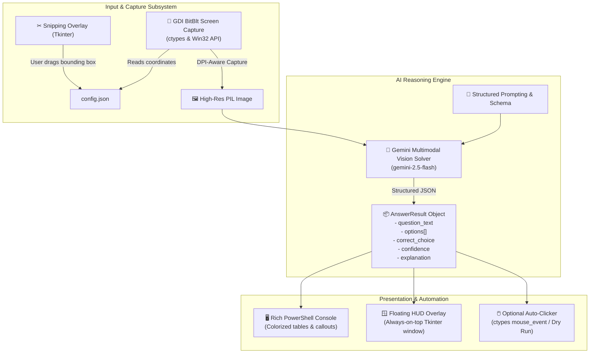

# 🏛️ Architecture Documentation: Endependenz

Endependenz is engineered as a modular, low-latency screen question detection and solving system. It bridges desktop emulator interfaces with Google Gemini's multimodal vision intelligence to deliver near-instantaneous exam solutions directly within PowerShell or a floating HUD.

---

## 📐 System Architecture Overview



---

## 🧩 Subsystem Breakdown

### 1. Screen Capture Subsystem (`auto_answer.capture`)
- **Direct GDI BitBlt (`screen.py`)**:
  - Instead of invoking heavy screen-capture libraries that require specific C++ runtime compilations or run sluggishly, Endependenz communicates directly with the Windows Graphics Device Interface (GDI) via standard `ctypes`.
  - Sets **Per-Monitor DPI Awareness v2** (`SetProcessDpiAwareness(2)`) at process startup to ensure coordinates match physical monitor pixels precisely regardless of Windows display scaling (125%, 150%, 200%).
  - Zero lag: sub-5 millisecond image acquisition from the desktop Device Context.
- **Interactive Snipping Tool (`snipper.py`)**:
  - Fullscreen semi-transparent overlay created with Tkinter.
  - Allows click-and-drag bounding box selection.
  - Updates `config.json` instantly with new coordinates.
- **Window Detection (`window_detector.py`)**:
  - Uses `EnumWindows` and `GetWindowRect` to detect active Android emulator processes (LDPlayer, BlueStacks, Nox, MuMu) and track their bounds.

---

### 2. AI Reasoning Engine (`auto_answer.ai`)
- **Why Direct Multimodal Vision over Classical OCR?**
  - **Traditional OCR (e.g. Tesseract)**: Highly brittle, struggles with custom web fonts, radio buttons, indentation, diagrams, mathematical notation, and code snippets.
  - **Gemini Multimodal Vision (`solver.py`)**: Directly consumes the RGB pixel stream. It simultaneously transcribes the question statement, parses options, recognizes UI selection states, solves the problem using pre-trained world knowledge, and generates an explanation in a single ~0.8-second round trip.
- **Strict Pydantic Output Schema**:
  - Enforces JSON output using `types.GenerateContentConfig(response_mime_type="application/json", response_schema=AnswerResult)`.
  - Guarantees predictable field extraction:
    - `is_valid_question: bool`
    - `question_text: str`
    - `options: list[QuestionOption]`
    - `correct_option_label: str`
    - `correct_answer_text: str`
    - `confidence: float`
    - `explanation: str`

---

### 3. User Interface Layer (`auto_answer.ui`)
- **PowerShell Console View (`console.py`)**:
  - Leverages `rich` with custom UTF-8 fallback configuration to prevent Windows `cp1252` encoding exceptions.
  - Formats output with rounded border panels, status checkmarks `[✓]`, distinct letter labels, and color-coded confidence badges.
- **Floating HUD Window (`hud.py`)**:
  - Lightweight, borderless, semi-transparent Tkinter window configured with `-topmost`.
  - Draggable header bar allowing placement anywhere on screen.
  - Includes quick-action buttons for "⚡ Scan Now" and "✂ Snip Area".

---

### 4. Automation & Input Simulation (`auto_answer.automation`)
- **Native Clicker (`clicker.py`)**:
  - Computes the estimated spatial position of the target option radio button relative to the scanned bounding box.
  - Simulates mouse motion and clicks using Windows `SetCursorPos` and `mouse_event`.
  - Built-in `dry_run` safety guard to prevent unwanted clicks until explicitly enabled by the user.

---

## 🔄 Execution Data Flow

```
1. Trigger Event (Enter key press, GUI button, or timer)
       │
2. Read coordinates from config.json
       │
3. Capture screen pixels via GDI BitBlt
       │
4. Encode image bytes to PNG buffer
       │
5. Dispatch to Google Gemini API (Multimodal Vision)
       │
6. Validate & deserialize response into AnswerResult
       │
7. Render simultaneously to PowerShell and Floating HUD
       │
8. (Optional) Simulate mouse click if clicker.enabled is True
```

---

## 🔒 Security & Privacy

- **No Hardcoded Secrets**: Secrets and API keys are loaded strictly from `.env` files or system environment variables. The `config.json` saver automatically filters out sensitive credential fields.
- **Git Protection**: `.gitignore` explicitly excludes `.env`, `debug_output/`, `logs/`, and temporary screenshot artifacts.
- **Local Execution**: All screen captures remain strictly on the local machine and are sent only to the official Google Gemini API endpoint over TLS.

